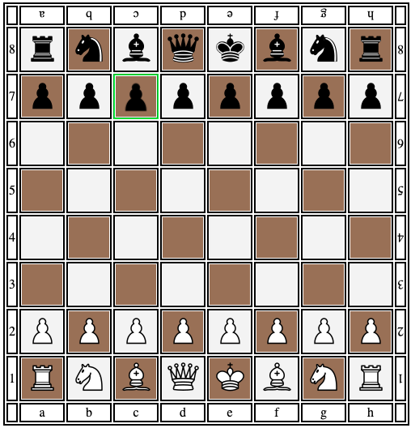

# Chess Board Single File Include

This repository provides a simple and lightweight chessboard component that can be easily included in your web project with minimal setup. With just one file inclusion and a few lines of code, you can have a fully functional chessboard on your website.
Only vanilla JS, HTML and CSS are used.
The official FEN notation format is supported.



## Demo

A live demo of the chessboard component can be found [here](https://fru1tyju1ce.github.io/chess-board-single-file-include/).


## Usage


### 1. Add a Board Container

Create a div element in your HTML file with the ID and class set to "board":
```html
<div id="board" class="board"></div>
```

### 2. Include the JavaScript File

Copy the `board.js` file from the `/include` directory into your project. Then, include the file in your HTML using a script tag:
```html
<script src="path/to/board.js"></script>
```

### Initialize the Chessboard

You're now ready to start using the chessboard component. Use the provided JavaScript functions to interact with the board.

## Functions Available

- `GAMEMODE`: A flag to toggle piece movement. When set to `false`, piece movement is deactivated. When set to `true`, piece movement is activated.

- `init()`: Initialises the board, GAMEMODE should be set.

- `spawnPiece(piece, square)`: Spawns a piece of the given type ('K' for king, 'Q' for queen, etc.) and color 'K' or 'k' (Capital letter means white),  on the specified square (in long notation, e.g., 'd6').

- `clear()`: Clears the board.

- `build()`: Builds the standard starting position.

- `movePiece(suqareId, targetSuqareId)`: Moves a piece from one square to another. If GAMEMODE is true sendControlInstruction(from, to) is called.

- `buildFromPosStr(posStr)`: Builds the board position from a given position string.

- `buildFromFEN(fen)`: Builds the board position from a given FEN string.

- `getSuqareOccupation(squareId)`: Returns a string with letter+Id of the piece, if the suqare is not occupied the return value is an empty string. 

- `getPosStr()`: Returns a JSON with actual posStr.

- `getLastPosStr()`: Returns a JSON with last/previous posStr.

- `getFEN()`: Returns a JSON with actual FEN.

- `getLastFEN()`: Returns a JSON with last/previous FEN.

- `getStartPositionFEN()`: Returns a String with the startpos. FEN.

- `rotateBoard()`: Rotates the board.

## Example

```javascript
// Create a board container
<div id="board" class="board"></div>

// Include the chessboard file
<script src="include/board.js"></script>

// Initialize the chessboard
<script>
  // Deactivate piece movement
  GAMEMODE = false;

  // Initialise the board (GAMEMODE has  to bne set already)
  init(); 

  // Spawn a white king on square d6
  spawnPiece('K', 'd6');

  // Clear the board
  clear();

  // Build the standard start position
  build();

  // Move a piece from e2 to e4
  movePiece('e2', 'e4');

  // Example position string
  const posStr = `
  r . b q k b n r 
  p p p p . p p p 
  . . n . . . . . 
  . B . . p . . . 
  . . . . P . . . 
  . . . . . N . . 
  P P P P . P P P 
  R N B Q K . . R`;
  
  // Build position from string
  buildFromPosStr(posStr);

  // Build position from official FEN notation string
  buildFromFEN('rnbqkbnr/pppppppp/8/8/4P3/8/PPPP1PPP/RNBQKBNR b KQkq e3');

  // Returns actual position string JSON format
  getPosStr();

  // Returns last/previous position string JSON format
  getLastPosStr()

  // Returns actual FEN string JSON format
  getFENS();

  // Returns last/previous FEN string JSON format
  function getLastFEN()

  // Rotate the board
  rotateBoard();

  // Activate piece movement
  GAMEMODE = true;
  init(); // <-- Always use init() after GAMEODE change
                 to (re)initialize the eventhandler
</script>
```
